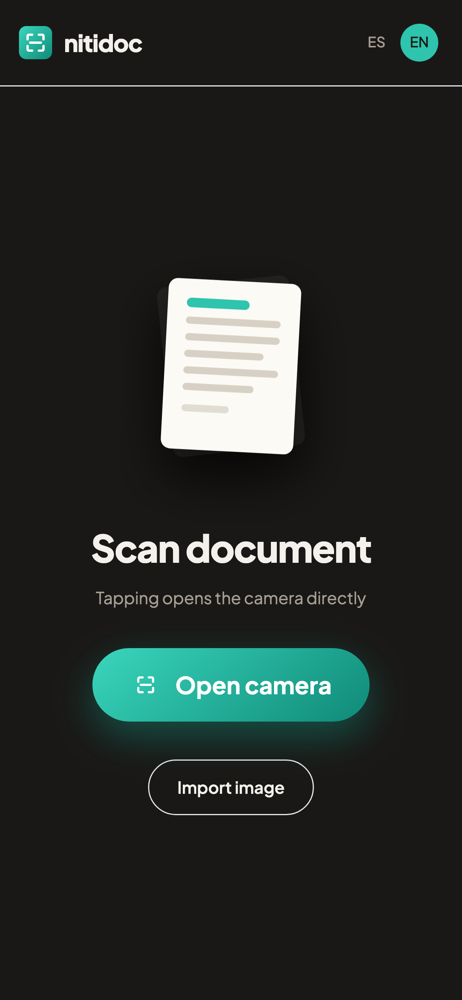
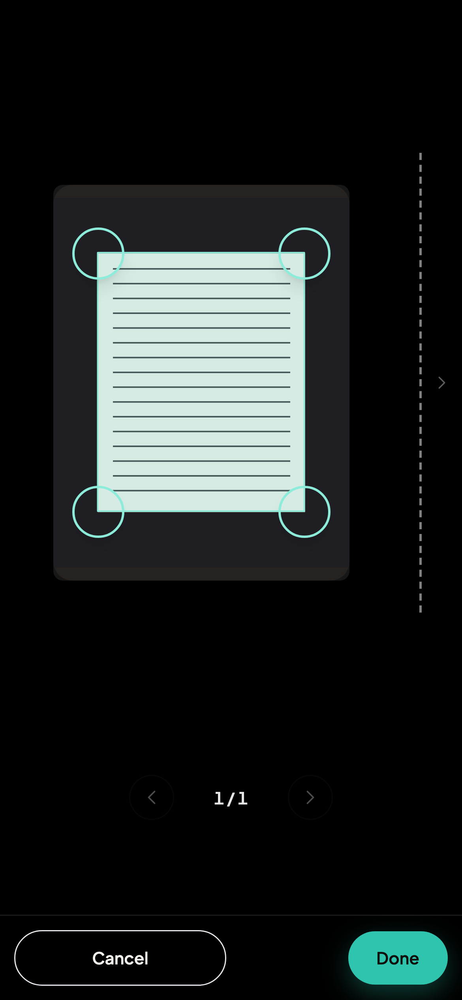
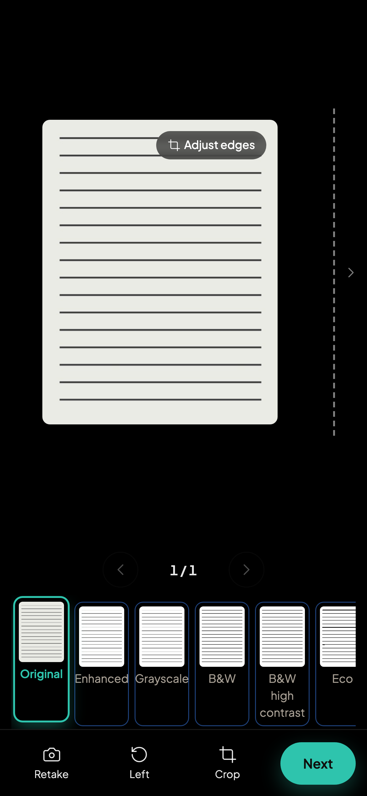
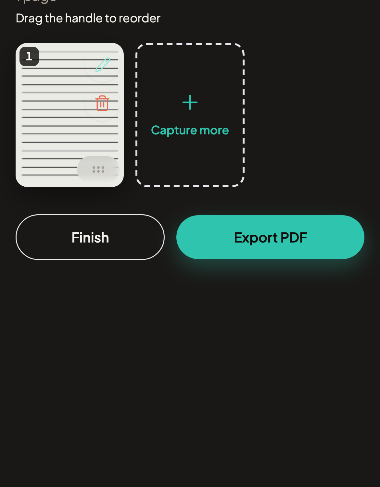

<div align="center">


# Nitidoc

**A document scanner that never sees your documents.**

Point your phone at a page. Nitidoc finds its edges, straightens the perspective
and hands you a clean PDF — entirely inside the browser, on your own device.
No account, no upload, no watermark, no page limit.

[**Try it → nitidoc.com**](https://nitidoc.com)

[](https://github.com/santiagoisra/nitidoc/actions/workflows/ci.yml)
[](LICENSE)
[](#testing)
[](#install-it-as-an-app)
[](#why-this-exists)

</div>

<!-- A table, because GitHub's stylesheet sets README images to display:block —
     inline markup stacks them whatever the width. One cell per screenshot is
     what actually produces a row; valign="top" keeps them level even though the
     last one is a shorter crop; and widths are pixels because the HTML
     sanitizer discards percentages. -->

<table>
  <tr>
    <th align="center">Capture</th>
    <th align="center">Adjust the edges</th>
    <th align="center">Pick a filter</th>
    <th align="center">Export the PDF</th>
  </tr>
  <tr valign="top">
    <td align="center"></td>
    <td align="center"></td>
    <td align="center"></td>
    <td align="center"></td>
  </tr>
</table>

## Why this exists

Every mobile scanner app does the same three things — detect the page, fix the
perspective, export a PDF — and then charges you for the fourth: removing the
watermark, unlocking multipage, lifting the export limit. Meanwhile your
documents (contracts, IDs, prescriptions, invoices) travel to somebody else's
server so a stranger's computer can crop them.

Nitidoc does the whole job in the browser tab. There is no backend to send a
page to: capture, edge detection, perspective warp, filters and PDF assembly all
run on your device, on your CPU. That is not a privacy promise on a marketing
page — it is the architecture, and this repository is how you check it.

## What it does

- **Live edge detection** while the camera is open, with auto-capture when the
  page holds still, and quality warnings for blur and low light.
- **Perspective correction** — a photographed page taken at an angle comes out
  rectangular and de-skewed.
- **Tap-to-fix edges.** Detection is automatic; the corner handles are there for
  the cases it gets wrong, not for every scan.
- **Multipage documents** — capture many pages in a row, browse them in a
  carousel, reorder them by dragging, delete or re-shoot any of them.
- **Six filter presets** — Original, Enhanced, Grayscale, B&W, B&W high contrast
  and Eco (lighter ink for printing).
- **PDF export** with no watermark and no page cap. Import an existing photo
  instead of using the camera if you prefer.
- **Installable and offline.** Add it to your home screen and it works with the
  plane on airplane mode.
- **Spanish and English** UI (`es-AR` by default).

## Install it as an app

Open [nitidoc.com](https://nitidoc.com) and add it to your home screen:

- **iPhone / iPad (Safari):** Share → *Add to Home Screen*.
- **Android (Chrome):** the *Install app* button, or menu → *Install app*.
- **Desktop (Chrome/Edge):** the install icon in the address bar.

Once installed it opens full-screen like a native app and runs offline — the
service worker precaches the app shell and the OpenCV runtime.

## Run it locally

Requires **Node.js 22+** and **npm 10+**.

```bash
git clone https://github.com/santiagoisra/nitidoc.git
cd nitidoc
npm install
npm run build && npm run preview
```

Then open the printed URL. Use `build && preview` rather than `npm run dev` for
anything involving detection — see the caveat below.

| Command | What it does |
| --- | --- |
| `npm run dev` | Vite dev server with HMR (no OpenCV — see below) |
| `npm run build` | Type-check + production build to `dist/` |
| `npm run preview` | Serve the production build locally |
| `npm test` | Unit tests (Vitest) |
| `npm run test:e2e` | End-to-end tests (Playwright) |
| `npm run typecheck` | `tsc --noEmit` |

### ⚠️ OpenCV does not load under `npm run dev`

OpenCV.js is the official prebuilt **classic** Emscripten UMD build. It only
bootstraps inside a **classic** Web Worker via `importScripts` — it hangs in an
ES-module worker. Production builds bundle the detection worker as a classic
IIFE, so there it initializes in ~0.5 s.

Vite's dev server does not bundle workers, so under `npm run dev` the worker is
served as unbundled ES modules that a classic worker cannot parse. The scanner
detects this, fails fast and **degrades gracefully**: importing an image and the
manual corner editor still work, but automatic detection and the warp are
unavailable. Use `npm run build && npm run preview` to exercise the full
pipeline. This is a dev-ergonomics limitation, not a production issue.

## How it works

```
src/
├── app/                  # shell + routing
├── styles/tokens.css     # design tokens (CSS variables)
├── features/
│   ├── scanner/
│   │   ├── worker/       # opencv.worker.ts (classic) + message contract
│   │   ├── hooks/        # useCamera, useDocumentDetection
│   │   ├── components/   # CameraView, CropOverlay, AdjustScreen, PageGrid…
│   │   ├── lib/          # opencvLoader, workerClient, geometry, captureFrame…
│   │   └── store/        # Zustand scanner store
│   └── pwa/              # install prompt + platform detection
└── shared/               # ui/, i18n/, lib/, types/
```

Three decisions explain most of the codebase:

**Original frames are immutable.** An edit — corners, aspect ratio, rotation,
filter — is never burned into the pixels. It is a serializable `EditRecipe`
applied at render and export time, which is what makes undo, re-cropping and
re-exporting possible without asking you to shoot the page again.

**Detection and warping live in a Web Worker.** OpenCV runs off the main thread
with `OffscreenCanvas` and transferable buffers, so the camera preview never
stutters while a frame is being analysed. The pure geometry is DOM-free and
unit-tested on its own.

**The heavy part is not in the bundle.** OpenCV.js is ~10 MB of WASM served as a
static asset and loaded by the worker on demand; the initial JS bundle stays
around 60 KB gzipped.

Also worth knowing: single-threaded OpenCV (no WASM threads) to dodge a known
threads-in-worker bug and the COOP/COEP headers it would force; and jscanify was
evaluated and dropped because it returns an `HTMLCanvasElement` and therefore
cannot run in a worker at all.

## Testing

```bash
npm test         # 342 unit tests across 39 files (Vitest)
npm run test:e2e # Playwright: app shell, camera, permission denial, import flow
```

Unit tests cover geometry, detection math, the edit recipe, the store, the
camera and detection lifecycles, the worker protocol, i18n and the PWA install
path. CI runs the type-check, the unit suite and a production build on every
pull request.

Calibration thresholds (blur, darkness, corner-stability window) are starting
values still being tuned against real devices — if a threshold misbehaves on
your phone, that is a genuinely useful bug report.

## Contributing

Contributions are welcome, and the most valuable ones need no code: Nitidoc
touches camera APIs and WebAssembly across every mobile browser, so **testing it
on your device and reporting what broke** is real work. The iOS filter bug and
the edge-detection bug both took a real iPhone to find.

Read [CONTRIBUTING.md](CONTRIBUTING.md) for the branching model, commit
convention and the checks to run before opening a PR, and
[CODE_OF_CONDUCT.md](CODE_OF_CONDUCT.md) for how we treat each other. Bug
reports go through the [issue templates](.github/ISSUE_TEMPLATE); security
problems go through a [private advisory](SECURITY.md), never a public issue.

One constraint is not up for negotiation: **documents never leave the device.**
A feature that needs to upload a page will be declined no matter how convenient
it is.

## Tech stack

React 18 · TypeScript (strict, no `any`) · Vite 6 · Zustand · Tailwind CSS ·
OpenCV.js (WebAssembly) · jsPDF · dnd-kit · Vitest · Playwright · Firebase
Hosting

## License

Nitidoc is free software under the
[GNU Affero General Public License v3.0 or later](LICENSE).

You may use, study, share and modify it. If you run a modified version and let
other people use it over a network, the AGPL requires you to offer them its
source code as well. The point is blunt: Nitidoc can be forked, but it cannot be
quietly turned into the paywalled scanner it was built to replace.
